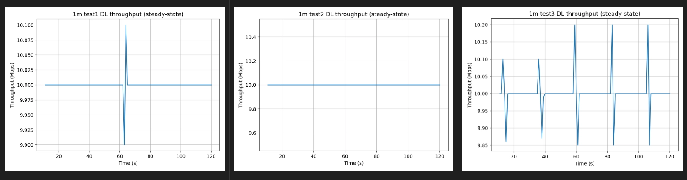
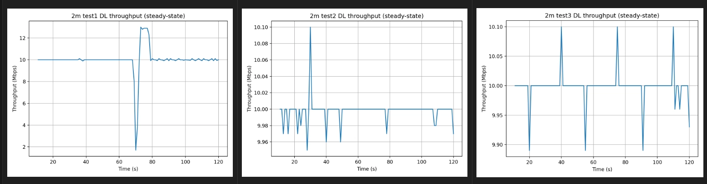
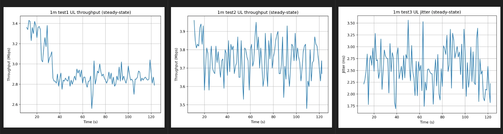
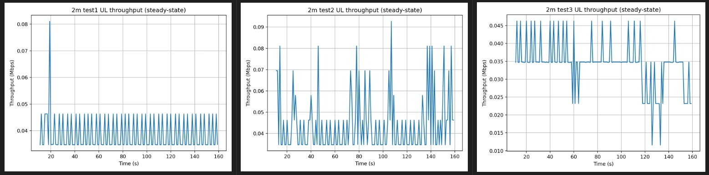
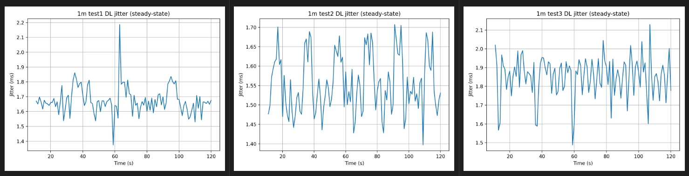
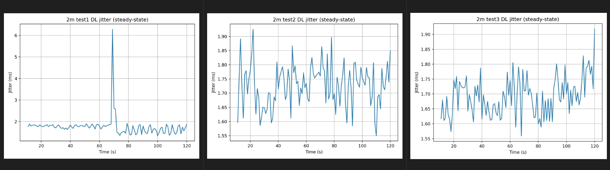
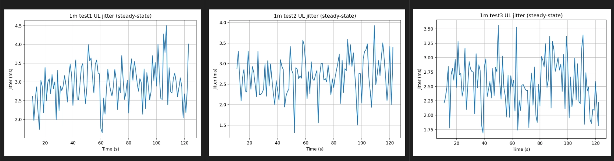
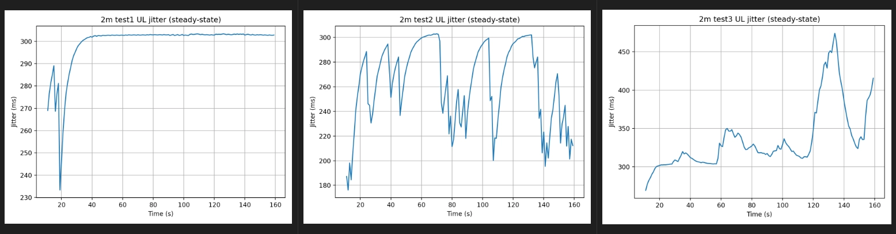
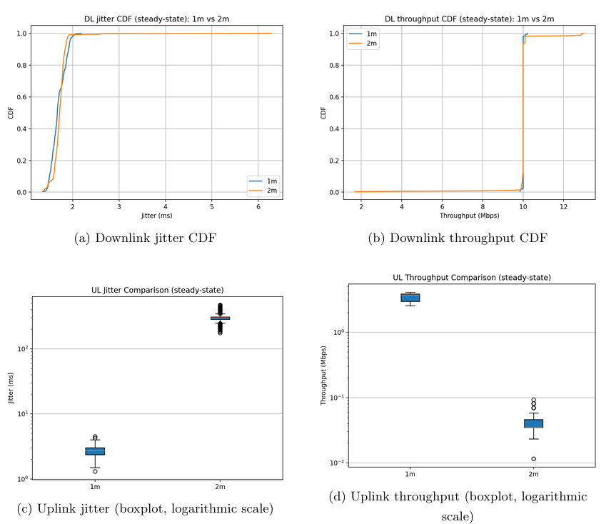

# Results

This section presents representative results obtained from the tests. The plots show the time-series evolution of throughput and jitter for both downlink (DL) and uplink (UL) transmissions.

Each experiment was repeated **three times** in order to verify repeatability and identify consistent performance trends.

## Downlink Throughput

At both **1 m and 2 m distances**, the downlink throughput remains extremely
stable and closely matches the offered traffic rate of **10 Mbps**.

The time-series plots show almost flat curves with only very small
interval-to-interval fluctuations. This behavior indicates that the downlink channel is able to sustain the target traffic continuously under the considered experimental conditions.

### DL Throughput at 1m distance

The time-series analysis of the downlink throughput at 1 m shows an almost perfectly constant behavior across all three tests. In every run, the achieved rate remains essentially equal to the offered 10 Mbps load, with only minimal interval-to-interval fluctuations. 

Test 2 is completely flat, while Tests 1 and 3 exhibit a few small transient deviations that remain within a very narrow range around the nominal value.
Overall, these results confirm that the downlink channel is able to sustain the target traffic continuously and reproducibly under the considered short-distance condition.

### DL Throughput at 2m distance

The time-series analysis of downlink throughput at 2 m shows a nearly constant rate equal to the offered 10 Mbps traffic in all three experiments. Apart from a brief transient event observed in one run, the throughput remains tightly centered around the target value with only minimal fluctuations attributable to measurement granularity. 

These results indicate that the moderate increase in UE–gNB separation from 1 m to 2 m does not introduce any significant degradation in downlink capacity under the considered configuration.

## Uplink Throughput

The uplink exhibits a different behavior due to the **grant-based nature of
uplink transmissions** and the **downlink-dominant TDD configuration**.

At **1 m distance**, the uplink throughput remains relatively stable but
shows larger fluctuations compared to the downlink.

At **2 m distance**, however, the uplink throughput degrades dramatically,
dropping to approximately **0.03–0.05 Mbps**. The time-series plots reveal a
bursty transmission pattern characterized by short successful transmission
periods separated by intervals of very low throughput.

This behavior suggests the presence of **retransmissions, delayed scheduling
opportunities, or buffering effects** in the uplink.

### UL Throughput at 1m distance

The uplink behavior at 1 m is noticeably different from the downlink. It is still stable, but it shows more variability.

Across the three experiments, the uplink throughput is roughly in the range ≈ 2.8 – 3.9 Mbps. This is significantly lower than the downlink throughput (10 Mbps), which is expected because:

- we configured a **downlink-dominant TDD pattern**,
- uplink has **fewer OFDM symbols available**,
- uplink transmission requires **scheduling grants from the gNB**.

So the system has **less uplink capacity by design**.

At the beginning of the **Test 1** (≈ 10–30 s), throughput is around 3.3–3.4 Mbps. Then around 30–35 s there is a clear transition, after which the throughput stabilizes around ≈ 2.8–2.9 Mbps. After that, fluctuations are small and the curve oscillates around the new level. This suggests that the system moves from a transient state (startup effects, scheduling adjustment) into a steady operating regime. There is one deeper dip around 65 s (~2.55 Mbps), but it is isolated.

**Test 2** is much more stable. The throughput remains mostly between 3.6  - 3.9 Mbps. There are several small dips (≈ 3.5 Mbps), but the general level is higher than in Test 1. This suggests that the radio link was slightly better during this run, fewer retransmissions occured and scheduling remained efficient. Overall, Test 2 represents the best uplink performance.
Test 3 is similar to Test 1 in terms of variability. Throughput oscillates approximately between 2.8 - 3.5 Mbps. The fluctuations are stronger than in Test 2, but there is no long-term degradation. This pattern is typical of uplink scheduling where resources are granted dynamically and small variations in link quality cause small rate changes.

Downlink looked perfectly flat because:

- the gNB controls transmission,
- the scheduler can continuously send data,
- the offered rate (10 Mbps) is below the downlink capacity.

Uplink is different because:

1. **Grant-based access:** the UE cannot transmit arbitrarily; it needs scheduling grants from the gNB.
2. **Power limitation:** the UE has limited transmit power.
3. **HARQ retransmissions:** if decoding fails, packets must be retransmitted.
4. **TDD structure:** uplink slots are fewer than downlink slots.

All of this produces the small oscillations we see.

### UL Throughput at 2m distance

In contrast to the downlink behavior, the uplink throughput at 2 m exhibits a pronounced degradation. **Across all three experiments, the achieved rate remains around 0.03–0.05 Mbps, nearly two orders of magnitude lower than the values observed at 1 m**. Moreover, the time-series analysis reveals a periodic oscillatory pattern characterized by short bursts of successful transmissions followed by intervals with minimal throughput.

Under normal conditions, a stable wireless link typically produces a relatively flat throughput time series with only minor fluctuations. The oscillatory behavior observed here instead suggests bursty transmissions separated by idle periods, likely caused by repeated retransmissions or delayed uplink scheduling opportunities. This interpretation is also consistent with the extremely large uplink jitter values measured at this distance.

## Downlink Jitter

Downlink jitter remains **low and stable** across all experiments.

Most values lie between **1.5 ms and 1.9 ms**, with only occasional transient
spikes. The time-series plots show small random fluctuations but no sustained
instability or long-term drift.

These results indicate that increasing the UE–gNB distance from **1 m to
2 m does not significantly affect downlink delay stability**.

### DL Jitter at 1m distance

All three figures show the **downlink jitter over time** during three independent experiments at **1 meter distance**. A single point meant that the jitter is measured during a 1-second interval: the plot connects the points with a line, but in reality the measurements are discrete samples.

Jitter naturally fluctuates  (it changes from point to point) because each second:

- packets may experience slighlty different delays,
- the scheduler may allocate resources differently,
- retransmissions may occur.

Let’s take a look at the y-axis ranges:

- **test 1** ≈ 1.35 ms – 2.2 ms,
- **test 2** ≈ 1.40 ms – 1.71 ms,
- **test 3** ≈ 1.48 ms – 2.13 ms

Even though the curves look different, the actual values are extreamely similar. Most samples in all tests fall around 1.6 ms - 1.9 ms. So the baseline jitter is the same.

The three curves look different beause the **jitter is inherently noisy**. 
Jitter measures **packet delay variation**, which depends on many factors like MAC scheduler, buffering or HARQ retransmissions.
For example, the gNb MAC scheduler may delay a packet by one extra slot. Or, if a blovk is decoded incorrectly, this introduces additional delay variation.

Hence, **the time-series analysis of the downlink jitter at 1 m shows a consistently stable behavior across the three independent tests**. In all cases, the jitter remains tightly bounded between approximately 1.5 ms and 1.9 ms, with only occasional transient fluctuations. Test 1 and Test 3 exhibit isolated spikes reaching approximately 2.1–2.2 ms, while Test 2 shows slightly smoother behavior. However, the overall jitter levels remain comparable across all tests, indicating a stable and reproducible downlink scheduling performance under the considered experimental conditions.

### DL Jitter at 2m distance

The **downlink behavior at 2 m looks very stable and consistent**, and it is actually very similar to what we observed at **1 m**. The only unusual element is the **single large spike in test1**, but it appears to be a transient event rather than a systematic problem.
Across the three experiments, the downlink jitter mostly stays in the range **≈ 1.6 ms – 1.8 ms**. 
This is almost identical to what wesaw at **1 m**, which indicates that increasing the distance from 1 m to 2 m **does not significantly affect downlink delay stability**. 
Furthermore, the curves show small random fluctuations, no persistent drift, no sustained instability, no progressive degradation over time. This is the signature of a **stable radio link**.

**The moderate increase in UE–gNB separation from 1 m to 2 m does not significantly affect downlink jitter, which remains tightly bounded around 1.6–1.8 ms across all experiments**. Apart from a single transient spike observed in one run, the time-series behavior remains stable and reproducible.

## Uplink Jitter

In contrast to the downlink, the uplink jitter exhibits significantly larger
variations.

At **1 m**, the jitter typically ranges between **2 ms and 4 ms**, reflecting
the dynamic nature of uplink scheduling.

At **2 m**, the uplink jitter increases dramatically, reaching values of
**hundreds of milliseconds**. The plots show large oscillations and
progressive increases in delay variation, suggesting **buffer buildup and
scheduling instability**.

This highlights the higher sensitivity of uplink transmissions to channel
conditions in the considered experimental setup.

### UL Jitter at 1m distance

In uplink, the jitter is mostly around:

- **test1:** about **2.0–4.5 ms**
- **test2:** about **1.3–3.9 ms**
- **test3:** about **1.7–3.6 ms**

So compared with DL, UL shows a **higher baseline jitter**, **larger fluctuations**, **more frequent spikes** and less repeatability over time. That means the uplink delay is more variable.

**Test 1** is the most irregular of the three: many samples are around 2-5-3.5 ms, several peaks go above 4 ms and there is no long, flat stable region. So, this test suggests a fairly noisy UL scheduling process.
**Test 2** is a bit more controlled than test 1, but still clearly variable. Most values stay between 2.2 and 3.1 ms, there are some deep dips and some peaks near 4 ms and it is still much noisier than DL.
**Test 3** looks slightly more compact than test 1, but still unstable compared to downlink. Most samples are around 2.2-3.0 ms, some peaks reach 3.5 ms and several rapid oscillations appear across the whole test.

So all three tests tell the same story: **uplink is consistently more jittery than downlink**.

These results are consistent with the downlink-dominant TDD allocation strategy.
So, in contrast to the downlink, **the uplink jitter time series at 1 m exhibits substantially larger fluctuations and a higher overall level**. Across all three tests, the UL jitter typically lies between about 2 and 3.5 ms, with several transient peaks approaching 4 ms or more. Although the exact temporal evolution differs among runs, the three experiments consistently indicate that uplink transmission is more delay-variable and less repeatable than downlink transmission, likely due to the stronger impact of uplink scheduling and retransmission dynamics.

### UL Jitter at 2m distance

These plots indicate that **the uplink is entering a strongly unstable or congested regime**. The jitter increased by roughly two orders of magnitude. This is not a small degradation, it means the uplink scheduling or buffering behavior changes drastically.

**Test 1** shows a ramp-up and then a plateau. The jitter starts around 270 ms, quickly increases to ~303 ms and then becomes extreamely flat. The flat line means packets are arriving with almost constant delay variation, but that delay variation is already very large. In other words, packets are probably queued before transmission, producing a constant high jitter.
**Test 2**’s plot is very chaotic. We see repeated increase-drop patterns with jitter between roughly 180 ms - 305 ms. This kind of pattern usually indicates **periodic congestion or scheduling instability**.
So the system oscillates between buffer filling and buffer draining.
**Test 3** is the most extreme case. Jitter gradually increases from about **270 ms → 470 ms** with large fluctuations. That means the **delay variance keeps growing**, which typically happens when the uplink queue becomes very large. This behavior is characteristic of **buffer buildup**.

These results strongly suggest that **the uplink link quality degraded enough at 2 m that the system cannot transmit packets smoothly anymore**.
Instead, packets accumulate in buffers before being scheduled. That causes large delay fluctuations and, consequently, large jitter, and since iperf is sending traffic continuously, the queue keeps changing.

While the downlink remains largely unaffected by the increase in distance, the uplink experiences a dramatic rise in jitter at 2 m, with values reaching several hundreds of milliseconds. The time-series behavior suggests the presence of buffering and scheduling instability, likely caused by reduced uplink link quality and retransmission dynamics. This highlights the higher sensitivity of uplink transmission to channel conditions in the considered experimental setup.

### Comparison Between Scenarios (1 m vs 2 m)

The following figure summarizes the steady-state performance comparison between the **1 m** and **2 m** UE–gNB distances.

The plots compare the distributions of **throughput** and **jitter** for both
downlink (DL) and uplink (UL) transmissions. Downlink metrics are represented
using **empirical cumulative distribution functions (CDFs)**, while uplink
metrics are shown with **boxplots on a logarithmic scale** to highlight
differences spanning multiple orders of magnitude.

The results reveal a clear **asymmetry between downlink and uplink behavior**.

- **Downlink performance** remains essentially unchanged when increasing the
  UE–gNB distance from **1 m to 2 m**. The jitter distributions almost overlap,
  and the throughput remains tightly concentrated around the configured
  **10 Mbps offered load**, indicating that the downlink operates well below
  saturation.

- **Uplink performance**, on the other hand, exhibits a dramatic degradation.
  The jitter increases from **millisecond-scale variability at 1 m to
  hundreds of milliseconds at 2 m**, while throughput collapses from several
  **Mbps to only tens of kbps**. The logarithmic representation highlights that
  this degradation spans **nearly two orders of magnitude**.

Overall, the comparison shows that while the **downlink remains robust under
moderate distance increases**, the **uplink transitions to a highly unstable
operating regime at 2 m**, characterized by very low throughput and extremely
large delay variability.

## Conclusion

These baseline results provide a reference for future experiments involving
**Reconfigurable Intelligent Surfaces (RIS)**, where potential improvements
in radio performance metrics will be investigated.